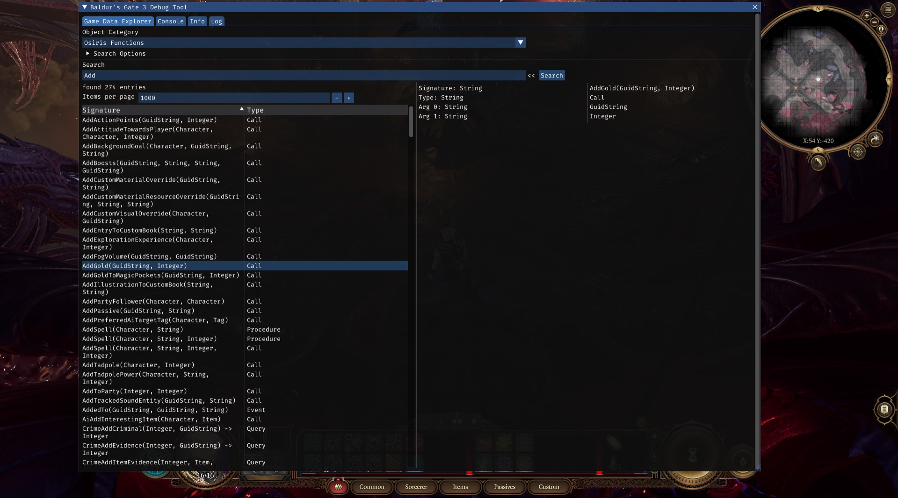

# bg3-debug-tool

A WIP debugging tool for Baldur's Gate 3.

Can be used to browse the game's data like templates, items, spells, passives
and more.

# Showcase

# Installation

Put `bg3-debug-tool.dll` and `bg3-debug-tool.exe` to into the game's `bin`
directory and launch the game through the `bg3-debug-tool.exe`.

# Credits

Norbyte and other [Baldur's Gate 3 Script Extender](https://github.com/Norbyte/bg3se) developers
for the game's decompiled data
